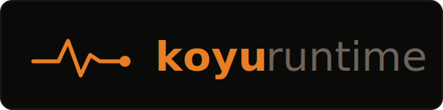

<p align="center">
  
</p>

<p align="center">
  <a href="https://discord.gg/53AXspMaN"></a>
  <a href="https://koyu.dev/docs"></a>
</p>

# koyu-runtime

koyu-runtime is the robot half of [koyu](https://koyu.dev), an open platform
for robot learning. It runs on the robot box as a set of supervised processes
that talk over shared memory. The runtime is meant to be modified for your
robot: a fresh clone is a starting point, and the services that make it
useful are the ones you add.

The runtime exists so that a coding agent can add those processes easily. It
is built on [supervisord](http://supervisord.org/) for process management and
[iceoryx2](https://github.com/eclipse-iceoryx/iceoryx2) for zero-copy IPC,
chosen so that agentic introspection and iteration speed stay as high as
possible. Every interface fits in an agent's context window, and everything
the runtime knows is one `koyu` verb away (the shipped ipc_logger service
records every declared topic and event channel to make that true).

The core contribution of this runtime is the convention and the architecture.
The central convention splits state by the temporal frequency at which it
changes. Configuration that changes rarest lives as environment variables in
`services.yaml`, where a change means a process restart; on a settled robot
these can hold still for months. State that changes during a session, at
rates below roughly one hertz, moves through durable file inboxes: the
current task, provenance metadata, tunable parameters. The shipped
param_server service owns this tier. Everything faster belongs to iceoryx2
shared memory, with pub/sub streams for camera-rate data at 30 FPS and
north, and payload-free events as doorbells between processes.

The runtime also ships a data recorder, since data is the staple of robot
learning and recording logic is genuinely tricky to get right. It captures
on a camera clock so that every parquet row lines up with every video frame,
merges evaluation verdicts as episodes finish, and commits each episode
bundle with a single atomic rename.

A typical beginning: add a CAN adapter service that speaks to your robot's
motor controllers and publish its state over shared memory. From there, the
conventions in the docs cover wiring telemetry and video into your browser
and adding peripherals, such as a keyboard or a foot pedal that actuates a
mechanism on the robot.

Robot learning also means trying different policies and different inference
code. The runtime carries conventions for tracking provenance across those
experiments: your agent registers evaluation metadata with `koyu context`,
wires the policy process into the robot with the same supervisord and
iceoryx2 tools, and every recorded episode keeps its lineage back to the
exact checkpoint that produced it.

The runtime pairs with [koyu-workspace](https://github.com/vdesai2014/koyu-workspace)
and the cloud side at [koyu.dev](https://koyu.dev), which together keep track
of the relative successes and failures of the techniques you try.

## Getting started

```bash
git clone https://github.com/vdesai2014/koyu-runtime
cd koyu-runtime
pip install -e .
```

The editable install is intentional, since the point is modification. The
`koyu` command arrives via [koyu-cli](https://pypi.org/project/koyu-cli/),
installed automatically as a dependency; this repo plugs the runtime verbs
into it: `koyu up · down · status · restart · apply · logs · set · get ·
tail · frame · context`.

From there:

1. Create a runtime directory for your robot with a `services.yaml`
   describing its processes. The first recipe in the manual walks through
   one.
2. Point your coding agent at [AGENTS.md](AGENTS.md), the manual of runtime
   actions: adding sensors and peripherals, wiring video and telemetry to
   the browser, recording episodes, registering provenance.
3. Bring it up and look around:

```bash
koyu up -r <your-runtime-dir>
koyu status
```

## Documentation

| doc | for | question it answers |
|---|---|---|
| [AGENTS.md](AGENTS.md) | coding agents | what is frozen, and how do I do X safely? |
| [docs/philosophy.md](docs/philosophy.md) | the curious | why is it built this way? |
| [KNOWN-ISSUES.md](KNOWN-ISSUES.md) | everyone | what do we know is rough? |
| [koyu.dev/docs](https://koyu.dev/docs) | platform-wide | how does it all fit together? |

## Contributing

The best way to contribute right now is through the
[Discord](https://discord.gg/53AXspMaN): architecture questions, design
arguments, and bug reports all welcome. Pull requests stay closed while the
codebase is moving this fast.

## Status

koyu as a whole is in alpha. [KNOWN-ISSUES.md](KNOWN-ISSUES.md) lists what we
know is rough today, and the coming months are for addressing it.
